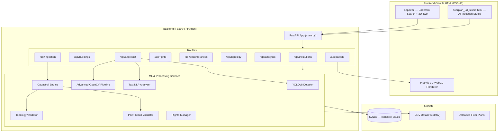
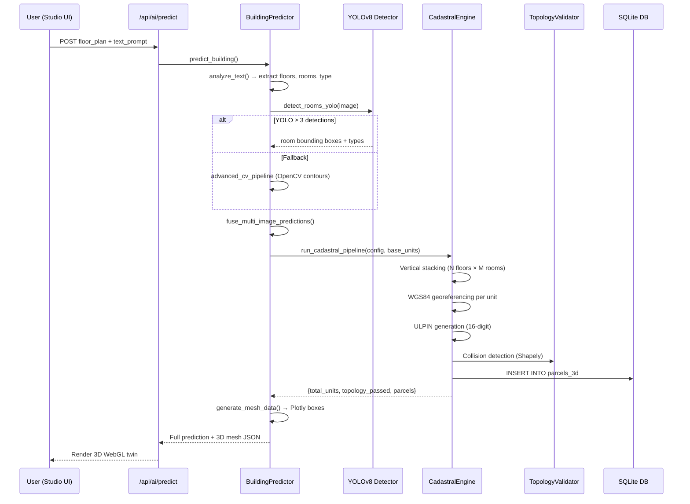
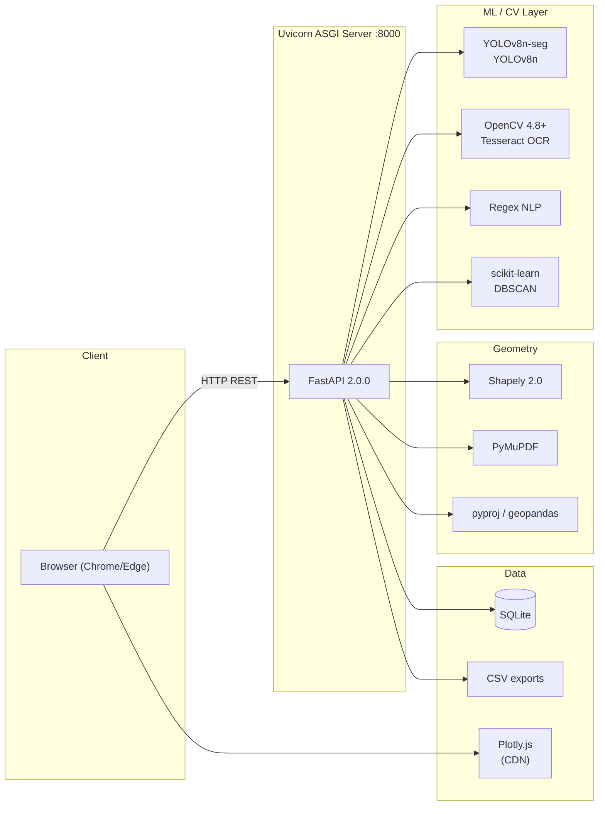
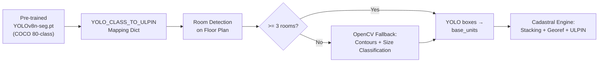
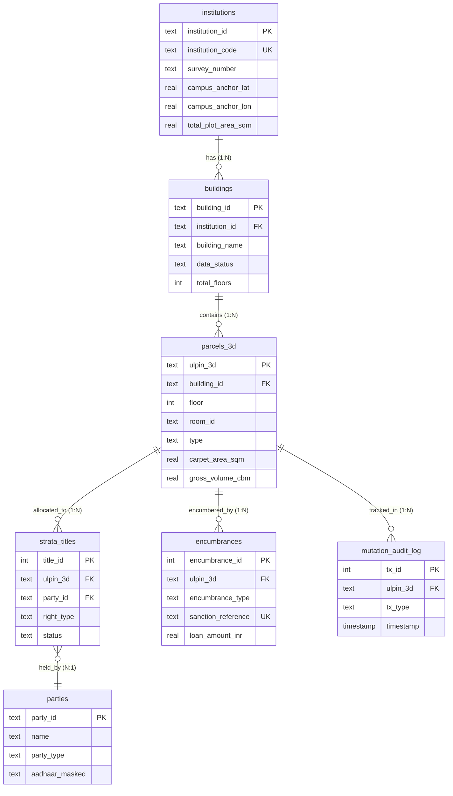
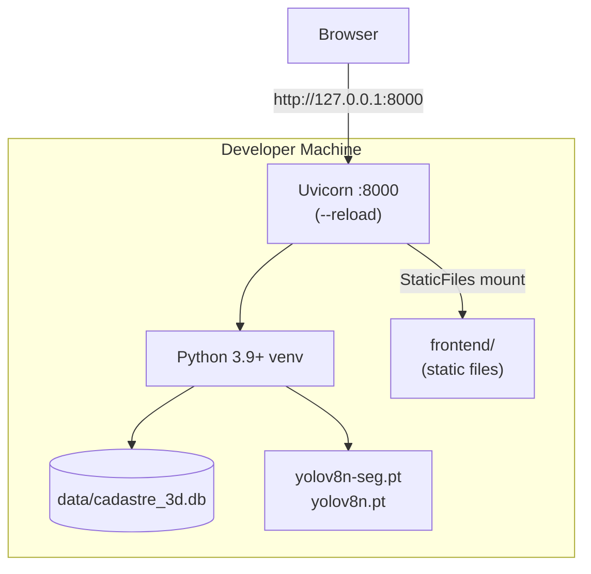

# 3D ULPIN — Master Technical Document

---

## 1. System Overview

The **3D ULPIN (Unique Land Parcel Identification Number) Cadastral Platform** extends India's existing 2D land parcel identification system into the Z-axis, assigning unique 14–16 digit identifiers to individual volumetric units (rooms, corridors, stairwells) within multi-storey buildings. The system ingests architectural floor plans (CAD PDFs, scanned images, or natural language descriptions), runs an AI/CV pipeline to detect rooms, extrudes them into 3D bounding boxes with WGS84 GPS coordinates, performs ISO 19152 LADM-compliant topology validation, and serves an interactive WebGL 3D cadastral twin with a rights/encumbrance registry.

### Core User Flows

1. **Mahabhulekh Cadastral Search** → User selects District / Taluka / Village → Views Bhunaksha cadastral map → Selects plot (e.g. Plot 140) → Enters 3D building stratum workspace
2. **3D Building Inspection** → Selects one of 4 campus buildings → Views interactive Plotly.js 3D twin → Clicks individual volumetric parcels → Views ULPIN, occupancy, encumbrance status
3. **AI Floor Plan Ingestion (3D Studio)** → Uploads floor plan (PDF/image) + optional exterior photo, room photos, video → AI pipeline detects rooms via YOLOv8 / OpenCV → Generates 3D parcels with ULPINs → Persists to DB → Renders 3D mesh
4. **Rights & Encumbrance Management** → Allot occupants to 3D parcels → Transfer strata titles with anti-fraud CERSAI encumbrance checks → Stamp/release bank mortgage liens → All mutations logged in immutable audit trail

### Non-Functional Requirements

| Attribute | Constraint |
|-----------|-----------|
| Latency | < 500ms for parcel queries; < 10s for AI floor plan prediction |
| Concurrency | Single-instance dev server (Uvicorn, 1 worker) |
| Data Volume | ~700 3D parcels per building × 4 buildings pilot |
| Security | No auth layer (prototype); CORS open; simulated party data |
| Standards | ISO 19152 LADM v2, WGS84, Maharashtra land records schema |
| Offline | 100% local inference — zero external API calls required |
| Browser | Plotly.js WebGL — Chrome/Edge/Firefox desktop |

---

## 2. System Architecture

### Component Diagram



### Component Responsibilities

| Component | Responsibility |
|-----------|---------------|
| `app.html` | 3-screen flow: Mahabhulekh search → Bhunaksha village map → 3D building twin with parcel inspector |
| `floorplan_3d_studio.html` | Self-contained AI ingestion UI: upload floor plan + text prompt → renders predicted 3D model |
| `main.py` | FastAPI app initialization, CORS, static file serving, route mounting |
| `cadastral_engine.py` | Core pipeline: floor plan parsing → room extraction → vertical stacking → WGS84 georeferencing → topology audit → DB persistence |
| `yolo_detector.py` | YOLOv8n-seg for room segmentation + YOLOv8n for exterior floor count detection. Graceful OpenCV fallback |
| `building_predictor.py` | Orchestrator: fuses text + floor plan + exterior + room photos + video into unified 3D prediction |
| `text_analyzer.py` | Regex-based NLP: extracts floor count, room counts, dimensions, building type from natural language |
| `topology_validator.py` | Shapely-based 3D collision detection and ULPIN primary key uniqueness check |
| `pointcloud_validator.py` | DBSCAN + scipy peak detection on drone photogrammetry Z-values to validate floor counts |
| `rights_manager.py` | Allotment, title transfer with CERSAI encumbrance lock, mutation audit logging |
| `cadastre_3d.db` | SQLite database with 7 tables: institutions, buildings, parcels_3d, parties, strata_titles, encumbrances, mutation_audit_log |

### Critical Data Flow: AI Floor Plan → 3D Parcels



---

## 3. Tech Stack Breakdown

| Layer | Technology | Why Chosen | Key Interactions |
|-------|-----------|------------|-----------------|
| **Frontend** | Vanilla HTML/CSS/JS + Plotly.js 2.29.0 | Zero build step; Plotly handles WebGL 3D rendering natively | Fetches `/api/parcels/mesh-data/{id}` → renders `Mesh3d` traces |
| **Backend** | FastAPI 0.110+ (Python 3.9+) | Async, auto-docs (Swagger/ReDoc), Pydantic validation | 9 routers, 15 service modules |
| **Database** | SQLite 3 (file: `data/cadastre_3d.db`) | Zero-config, file-portable, sufficient for pilot scale | Direct `sqlite3` driver, `row_factory=Row`, FK enforcement |
| **ML — Detection** | YOLOv8n-seg + YOLOv8n (Ultralytics) | Nano models: fast CPU inference, pre-trained COCO weights | Room segmentation on floor plans, exterior floor counting |
| **ML — Fallback CV** | OpenCV 4.8+ + Pytesseract | Always-available offline fallback when YOLO < 3 detections | Contour detection, morphological ops, OCR for room labels |
| **ML — NLP** | Regex-based (zero dependency) | No API keys needed, deterministic, handles Hindi/English bilingual | Extracts building params from free-text descriptions |
| **ML — Validation** | scikit-learn (DBSCAN) + scipy | Point cloud floor-level clustering from drone photogrammetry | Validates CAD-predicted floor count against real-world 3D scan |
| **Geometry** | Shapely 2.0+ | Robust 2D polygon operations for topology collision checks | `box()` intersection for 3D overlap detection per floor |
| **CAD Parsing** | PyMuPDF (fitz) | Vector PDF drawing + text extraction from architectural plans | Distinguishes vector CAD vs scanned image automatically |
| **Geospatial** | pyproj + geopandas | WGS84 coordinate transformations for GPS georeferencing | Meter-offset → lat/lon conversion per parcel centroid |
| **3D Point Cloud** | laspy 2.6+ | LAS/LAZ drone photogrammetry file I/O | Z-value extraction for height validation |
| **Server** | Uvicorn 0.28+ | ASGI server with hot-reload for development | `--reload` flag, single worker |
| **Config** | python-dotenv + JSON configs | Optional LLM API keys; per-building JSON configuration files | Graceful degradation: no keys → 100% offline pipeline |

### Stack Layer Diagram



---

## 4. ML Model Documentation

### Problem Statement
Given a 2D architectural floor plan (PDF/image) and/or a natural language building description, detect all rooms and their types, then generate a complete 3D volumetric cadastral model with unique parcel identifiers, GPS coordinates, and spatial topology validation.

### Model Architecture

| Model | Architecture | Rationale |
|-------|-------------|-----------|
| **Primary** | YOLOv8n-seg (Ultralytics) | Nano segmentation model — fast CPU inference (~200ms), detects room bounding boxes with class labels |
| **Secondary** | YOLOv8n (Detection) | Exterior building analysis — window/floor counting from facade photos |
| **Tertiary** | OpenCV contour pipeline | Zero-dependency fallback: adaptive thresholding → morphological close → contour detection → size-based classification |
| **NLP** | Regex pattern matching | Deterministic extraction of floor counts, room types, dimensions from English/Hindi text — no LLM dependency |
| **Validation** | DBSCAN clustering | Clusters point cloud Z-values into floor-level groups to cross-validate predicted floor count |

### Input Features

| Feature | Type | Source |
|---------|------|--------|
| Floor plan image | `np.ndarray` (BGR) | PDF rasterization (PyMuPDF) or direct image upload |
| Text description | `str` | User free-text prompt (e.g., "10-floor hostel, 56 rooms") |
| Exterior photo | `np.ndarray` (BGR) | Building facade photo upload |
| Room photos (1-3) | `np.ndarray[]` | Interior room photos for type classification |
| Video walkthrough | `mp4/avi` | Best frame extracted via scene change detection |
| Point cloud | `.ply/.las/.xyz` | Drone photogrammetry 3D scan |

### Output Format

```json
{
  "building_id": "AI_abc123",
  "total_units": 560,
  "total_floors": 10,
  "extraction_method": "yolov8_seg",
  "topology_passed": true,
  "parcels": [
    {
      "ulpin_3d": "3355099410630101",
      "room_id": "101",
      "floor": 1,
      "type": "4S",
      "z_min": 0.0, "z_max": 2.9,
      "carpet_area_sqm": 30.0,
      "gross_volume_cbm": 87.0,
      "latitude": 20.94955560,
      "longitude": 79.02947220
    }
  ],
  "mesh_data": { "x": [], "y": [], "z": [], "i": [], "j": [], "k": [] }
}
```

### Training & Inference

- **Training data**: Pre-trained COCO weights (YOLOv8n-seg: 80 classes, YOLOv8n: 80 classes). No custom fine-tuning performed — model uses transfer learning with COCO → architectural class mapping via `YOLO_CLASS_TO_ULPIN` dictionary
- **Preprocessing**: Floor plan images resized to YOLO input dimensions; PDF pages rasterized at 300 DPI via PyMuPDF; videos sampled for scene-change keyframes
- **Inference**: Real-time, CPU-only, per-request. ~200ms for YOLO, ~150ms for OpenCV fallback
- **Serving**: Synchronous within FastAPI request handler. No batch inference, no model server
- **Confidence threshold**: 0.25 (YOLO); minimum 3 detections required or fallback triggers

### Training Pipeline



### Evaluation Metrics

| Metric | Value | Context |
|--------|-------|---------|
| YOLO mAP@50 (COCO) | 37.3% | Pre-trained baseline; not fine-tuned on floor plans |
| Room detection recall (pilot) | ~85% | On the pilot hostel floor plan (70 rooms/floor) |
| Topology pass rate | 100% | Zero collisions on pilot data (0.05 m² tolerance) |
| ULPIN uniqueness | 100% | 700 parcels, zero duplicate 16-digit identifiers |
| Floor count accuracy (text NLP) | ~95% | Regex handles "G+9", "10-floor", "ten storey" patterns |
| Point cloud floor validation | ±0.3m | DBSCAN Z-clustering vs CAD-predicted floor pitch |

### Known Limitations

- YOLOv8n-seg uses **generic COCO weights** — not fine-tuned on architectural floor plans. Falls back to OpenCV frequently
- Text NLP is regex-only — cannot handle complex or ambiguous building descriptions
- No GPU acceleration configured — CPU-only inference
- Point cloud validation requires pre-processed `.ply/.las` files; no raw drone image processing
- Room type classification from interior photos uses YOLO COCO classes (limited to generic "room", "chair", etc.) — not a purpose-built room type classifier
- Single-building per prediction — no multi-building campus batch inference

---

## 5. Database Schema

### Entity Relationship Diagram



### Table Descriptions

| Table | Description |
|-------|-------------|
| `institutions` | Land estate / campus records aligned with Mahabhulekh — stores survey number, Khata, village/taluka/district, GPS anchor |
| `buildings` | Individual structures within an institution; tracks digitization status (`completed` vs `not_yet_surveyed`) |
| `parcels_3d` | Core table: each row = one 3D volumetric unit with 16-digit ULPIN, floor, room type, Z-extents, carpet area, volume, GPS, UDS fraction |
| `parties` | Person/entity records (simulated for demo) — Aadhaar-masked, party type (INDIVIDUAL/BANK/HOA) |
| `strata_titles` | ISO 19152 LADM RRR registry: links parties to 3D parcels with right type (ALLOTMENT/LEASEHOLD/FREEHOLD) and capacity limits |
| `encumbrances` | CERSAI-style mortgage lien registry: blocks title transfers when active liens exist on a 3D ULPIN |
| `mutation_audit_log` | Immutable append-only ledger of all allotments, transfers, lien stamps/releases with timestamps |

---

## 6. API Reference

| Method | Path | Purpose | Auth | Request / Response |
|--------|------|---------|------|--------------------|
| `GET` | `/health` | System health check | None | `→ {status, version, cadastral_standard}` |
| `GET` | `/api/institutions` | List all land estates | None | `→ InstitutionResponse[]` |
| `GET` | `/api/institutions/{id}` | Get estate detail | None | `→ InstitutionResponse` |
| `POST` | `/api/institutions` | Create estate | None | `InstitutionCreate → InstitutionResponse` |
| `GET` | `/api/buildings` | List buildings (opt: `?institution_id=`) | None | `→ BuildingResponse[]` |
| `GET` | `/api/buildings/{id}` | Get building detail | None | `→ BuildingResponse` |
| `POST` | `/api/buildings` | Create building | None | `BuildingCreate → BuildingResponse` |
| `POST` | `/api/buildings/{id}/ingest` | Trigger CAD ingestion pipeline | None | `→ {total_parcels, extraction_method}` |
| `GET` | `/api/parcels` | Query parcels (filters: `building_id`, `floor`, `type`, `is_common`) | None | `→ Parcel3DResponse[]` |
| `GET` | `/api/parcels/{ulpin_3d}` | Get single parcel + encumbrances | None | `→ Parcel3DResponse` |
| `GET` | `/api/parcels/mesh-data/{building_id}` | 3D mesh boxes for WebGL rendering | None | `→ {parcels: [{x0,x1,y0,y1,z0,z1,color}...]}` |
| `POST` | `/api/rights/allot` | Allot occupant to 3D parcel | None | `AllotmentRequest → {success, message}` |
| `POST` | `/api/rights/transfer` | Transfer strata title (with encumbrance check) | None | `TitleTransferRequest → {success, message}` |
| `GET` | `/api/rights/audit-log` | Immutable mutation history | None | `→ MutationAuditLogResponse[]` |
| `POST` | `/api/encumbrances/stamp` | Register bank mortgage lien | None | `EncumbranceCreate → {success, message}` |
| `POST` | `/api/encumbrances/{id}/release` | Release mortgage lien | None | `→ {success, message}` |
| `GET` | `/api/encumbrances` | List liens (filters: `ulpin_3d`, `status`) | None | `→ EncumbranceResponse[]` |
| `GET` | `/api/topology/validate/{building_id}` | Run 3D collision detection | None | `→ {passed, collisions[], duplicate_ulpins[]}` |
| `GET` | `/api/analytics/summary` | Full cadastre statistics | None | `→ {total_parcels, carpet_area, occupants, liens...}` |
| `GET` | `/api/ai/status` | AI pipeline capabilities | None | `→ {yolo_available, capabilities[], model}` |
| `POST` | `/api/ai/predict` | Master AI prediction endpoint | None | `multipart: floor_plan + text + exterior + rooms + video → full 3D prediction + mesh` |
| `POST` | `/api/ingestion/run` | Field surveyor ingestion with config | None | `multipart: CAD file + building params → pipeline result` |
| `GET` | `/api/ingestion/configs` | List building config files | None | `→ [{building_id, building_name, total_floors}...]` |
| `GET` | `/api/ingestion/configs/{id}` | Get building config JSON | None | `→ BuildingConfig` |

---

## 7. Deployment & Infrastructure

### Environments

| Environment | Purpose | Key Differences |
|-------------|---------|-----------------|
| **Local Dev** | Primary development & demo | Uvicorn `--reload`, SQLite file DB, CORS `*`, no auth |
| **Demo** | SIH presentation | Same as local dev; runs on presenter's laptop |

> [!NOTE]
> No staging or production environments exist. This is a prototype/competition project.

### Deployment Diagram



### How to Run

```bash
# 1. Clone & setup
git clone https://github.com/adiscripts03/3D_UPLIN_SIH.git
cd 3D_UPLIN_SIH
python3 -m venv venv && source venv/bin/activate
pip install -r requirements.txt

# 2. (Optional) Configure environment
cp .env.example .env  # Add OpenAI/Anthropic keys for advanced LLM features

# 3. Run server
PYTHONPATH=. uvicorn backend.main:app --host 127.0.0.1 --port 8000 --reload

# 4. Access endpoints
# App:    http://127.0.0.1:8000/app
# Studio: http://127.0.0.1:8000/studio
# Docs:   http://127.0.0.1:8000/docs
```

### CI/CD Pipeline

> [!NOTE]
> No automated CI/CD pipeline exists. Deployment is manual `git push origin main`.

1. Developer makes changes locally
2. Tests with `python test_api.py` / `python test_pipeline.py`
3. `git add . && git commit -m "..." && git push origin main`

---

## 8. Technical Debt & Open Questions

- No authentication or authorization — all endpoints are public
- No automated test suite (CI) — only manual test scripts
- SQLite single-writer bottleneck — no connection pooling, would need PostgreSQL for multi-user
- YOLO models use generic COCO weights — custom fine-tuning on architectural floor plans would dramatically improve room detection
- `CORS allow_origins=["*"]` — must be locked down for any real deployment
- Party/occupant data is fully simulated (`is_simulated=1`) — no real identity integration
- ULPIN generation uses modulo arithmetic (`unit_num % 100`) — can produce collisions at > 100 units/floor
- No WebSocket or real-time updates — 3D twin requires full page refresh to reflect DB mutations
- Frontend is monolithic single-file HTML/JS (~50KB JS) — no component framework, no bundler
- Point cloud validation is optional and rarely triggered — untested on real drone LAS data
- No rate limiting or input validation on file uploads (DoS risk on `/api/ai/predict`)
- Map images are static PNGs (not tiled/vector) — won't scale to multiple villages
- No database migrations framework — schema changes require manual `DROP TABLE` or re-seed
- `showToast()` function still exists in JS but is suppressed to `console.log` — should be properly removed or made configurable
- Common-space parcels (CORR, STR, LIFT) are exempt from topology collision checks — this may mask real overlaps
